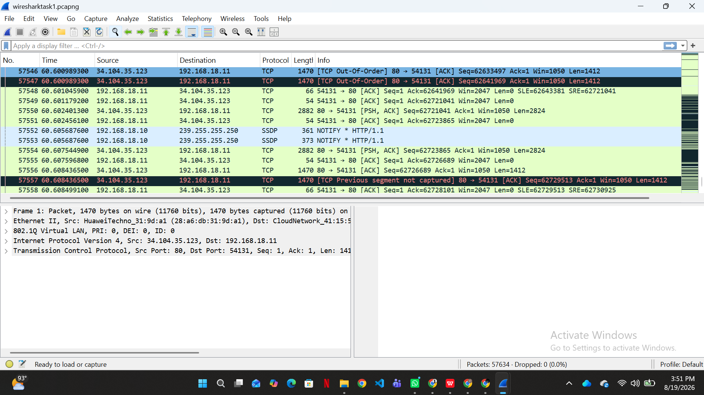

# Week 1 — Networking Basics: How Computers Talk

## Cyber Security Internship — DataNex

---

## Objective

The purpose of this activity was to understand how computers communicate over a network by capturing and examining real network traffic using Wireshark.

I captured traffic from my computer for approximately one minute. After stopping the capture, I selected and examined individual packets to understand how IP addresses, ports, protocols, and packets are used in network communication.

---

## Tool Used

### Wireshark

Wireshark is a network traffic analysis tool that captures and displays data travelling across a network. It allows users to inspect individual packets and view information such as IP addresses, ports, protocols, and packet details.

For this activity, I used Wireshark to capture and analyze my computer's network traffic.

---

# 1. IP Address

An IP (Internet Protocol) address is used to identify the source and destination of communication on a network. It helps ensure that data is sent from one device or server to the correct destination.

In the packet I selected from my Wireshark capture, I observed:

* **Source IP:** `34.104.35.123`
* **Destination IP:** `192.168.18.11`

The source IP address shows where the packet came from, while the destination IP address shows where the packet was being sent.

In this example, `34.104.35.123` was the remote source communicating with the destination address `192.168.18.11`.

This observation helped me understand that every network communication needs addressing information so that packets can travel between the correct source and destination.

---

# 2. Port

A port is a logical communication endpoint used by network applications and services. While an IP address identifies a device, a port number helps identify the specific communication endpoint involved in the connection.

In the packet I analyzed, Wireshark showed:

* **Source Port:** `80`
* **Destination Port:** `54131`

The communication can be represented as:

```text
34.104.35.123:80 → 192.168.18.11:54131
```

This shows that the packet was sent from the source IP address using port `80` to the destination IP address using port `54131`.

By examining the port information in Wireshark, I was able to see that network communication uses both IP addresses and port numbers to direct data correctly.

---

# 3. Packet

A packet is a small unit of data transmitted across a network. Instead of sending all information as one large piece, network communication is divided into smaller units that can travel across the network.

In Wireshark, I observed many packets during the capture. Each packet contained different information about the communication.

By selecting a packet, I could inspect details such as:

* Source IP address
* Destination IP address
* Source port
* Destination port
* Protocol
* Packet length
* Other network and protocol information

One packet from my capture contained the following information:

| Field                | Observation     |
| -------------------- | --------------- |
| **Source IP**        | `34.104.35.123` |
| **Destination IP**   | `192.168.18.11` |
| **Protocol**         | `TCP`           |
| **Source Port**      | `80`            |
| **Destination Port** | `54131`         |
| **Packet Length**    | `1470 bytes`    |

This packet information allowed me to see how Wireshark displays the details of data travelling across a network.

---

# 4. What I Learned

This activity helped me understand the basic information involved in network communication.

An IP address identifies where network communication comes from and where it is going. A port identifies a specific communication endpoint, while a packet carries a unit of data across the network.

Using Wireshark, I was able to observe actual network traffic rather than only learning these concepts theoretically. I could see source and destination addresses, protocols, ports, and packet information directly in the captured traffic.

This activity also showed me why understanding network communication is important in Cyber Security. By analyzing network traffic, security professionals can investigate connections and identify unusual or potentially suspicious activity.

---

# Evidence

## Wireshark Network Traffic Capture

The screenshot below shows the network traffic captured from my computer using Wireshark.

> **Insert your Wireshark screenshot here**

The capture displays multiple packets and includes information such as:

* Source
* Destination
* Protocol
* Length
* Packet information

### Screenshot


---

## Analyzed Packet Details

I selected one packet from the captured traffic and examined its details.

The selected packet showed:

* **Source IP:** `34.104.35.123`
* **Destination IP:** `192.168.18.11`
* **Protocol:** `TCP`
* **Source Port:** `80`
* **Destination Port:** `5413`
* **Packet Length:** `1470 bytes`

These details were used to understand how an IP address, port, and packet appear in actual network traffic.

### Screenshot



---

# Conclusion

This activity provided practical experience in capturing and examining network traffic with Wireshark.

By analyzing the captured traffic, I learned how to identify source and destination IP addresses, examine source and destination ports, and understand the basic information contained in a network packet.

The one-minute traffic capture demonstrated that communication between devices and servers takes place through packets containing addressing and protocol information. This activity gave me a better understanding of how data travels across a network and why packet analysis is an important skill in Cyber Security.
